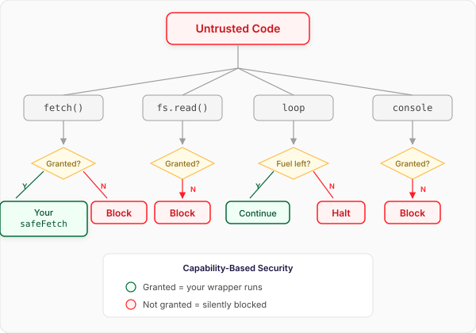

<!--{"parent": "ajs.md", "order": 2}-->

# Safe Eval

`eval` is too powerful to be allowed, which in practice means it is useless: no one sensible
lets untrusted code run with the full authority of the page, so the most dynamic feature in the
language goes unused. The goal was the opposite trade — make something **as powerful as
possible while still being safe** — and what came out is safer than the code around it. The
code that calls it is not guaranteed to halt, and neither is the code it calls; Safe Eval is.
So eval goes from the most dangerous execution environment in a project to the least dangerous.

It is the same machine as AJS — a fuel-metered VM with no ambient authority — exposed as the
two calls JavaScript already has: `eval()` becomes `Eval`, `new Function()` becomes
`SafeFunction`.

## `Eval` — run code once

`Eval` runs a snippet of code in the sandbox and returns what it produced, with the fuel it
used. The code sees only the `context` you hand it.

```js
import { Eval, SafeFunction } from 'tjs-lang/eval'

const { result, fuelUsed } = await Eval({ code: 'a + b', context: { a: 1, b: 2 } })
console.log(result) // → 3
console.log(fuelUsed > 0) // → true
```

Only context keys the code uses as names become variables, and a key never replaces a
builtin: a context entry called `Math` or `NaN` is ignored rather than rebinding it. A local
the code declares (`let a = …` or `const a = …`) shadows a context key of the same name.

## `SafeFunction` — compile once, call many times

`SafeFunction` turns a function body into a callable. Its parameters are **names**, and each
call returns the same shape as `Eval`.

```js
const add = await SafeFunction({ params: ['a', 'b'], body: 'return a + b' })
console.log((await add(1, 2)).result) // → 3
console.log((await add(20, 22)).result) // → 42
```

## Nothing runs forever

Every step costs fuel, and a run that spends its budget is stopped. The failure comes back as a
value — an `error` alongside the result — rather than as an exception the caller has to catch.

```js
const runaway = await Eval({
  code: 'let i = 0\nwhile (true) { i = i + 1 }\nreturn i',
  fuel: 100,
})
console.log(runaway.error.message) // → Out of Fuel
```

Creating a `SafeFunction` is the exception: a body that does not parse, or is over the source
size limit, throws when you create it — before any untrusted code has run.

## Nothing reaches out unless you allow it

The sandbox has no network, no file system and no globals. Network access goes through the
`httpFetch` atom, and only if you inject a `fetch` capability — so the untrusted code gets
_your_ `fetch`, with whatever rules you put in it.

A `fetch` capability returns the response **body** as plain data, not a `Response`: everything
a capability returns is copied across a boundary before the guest sees it, so the guest never
holds a live host object.

```js
const allowed = ['api.example.com']
const safeFetch = (url, init) => {
  if (!allowed.includes(new URL(url).host)) {
    throw new Error(`Domain not allowed: ${new URL(url).host}`)
  }
  return fetch(url, init).then((r) => r.json()) // the BODY, not the Response
}

const cheap = await Eval({
  code: `
    let products = httpFetch({ url: 'https://api.example.com/products' })
    return products.filter(x => x.price < budget)
  `,
  context: { budget: 100 },
  capabilities: { fetch: safeFetch },
})
console.log(cheap.result) // → [{"name":"widget","price":40}]

const blocked = await Eval({
  code: "return httpFetch({ url: 'https://evil.example.net/steal' })",
  capabilities: { fetch: safeFetch },
})
console.log(blocked.error.message) // → Domain not allowed: evil.example.net
```

## What the sandbox guarantees, and what it does not

Be precise here: a security claim you cannot cash is worse than none.

- **Termination is guaranteed, not decided.** Fuel metering sidesteps the halting problem
  rather than solving it: every step costs fuel and execution stops when it runs out, so a
  program either finishes or is stopped. A wall-clock timeout (by default ten milliseconds per
  unit of fuel) backs it up, and a stopped run cancels any request it had in flight.
- **Bounded memory.** The VM caps how much the guest can hold live at once (64 MB by default),
  separately from fuel, which bounds only how much work it does.
- **Bounded input.** Source over 64 KB is refused _before_ it is transpiled, because
  transpiling runs before fuel and the timeout apply. Raise or disable the cap with
  `maxSourceBytes` for trusted source.
- **No ambient authority.** The VM has no IO by default; the only way out is a capability you
  inject, and every atom that touches one is tagged as IO — a tagging that is itself tested, so
  the list of ways out can be enumerated.
- **The guest holds data, not references.** Capability returns cross a `structuredClone`
  boundary, so guest code cannot reach a host object or mutate one you still hold. A value that
  cannot be copied — a `Response`, a function, an object with getters — is rejected rather
  than passed through.
- **Layered and tested — not formally proven.** These properties are structural and could in
  principle be proven; today they are enforced by construction and covered by an adversarial
  test suite.
- **Known gap: cross-endpoint amplification.** Recursive agent calls are bounded by a depth
  header (`X-Agent-Depth`, max 10), but that is **cooperative** — it stops accidental loops,
  not an adversarial endpoint that drops the header. Rate-limit completely open endpoints.
- **Out of scope:** timing side channels, JavaScript-engine JIT bugs and memory-level attacks.
  A JavaScript-in-JavaScript sandbox cannot address those; put process isolation underneath if
  your threat model includes them.


